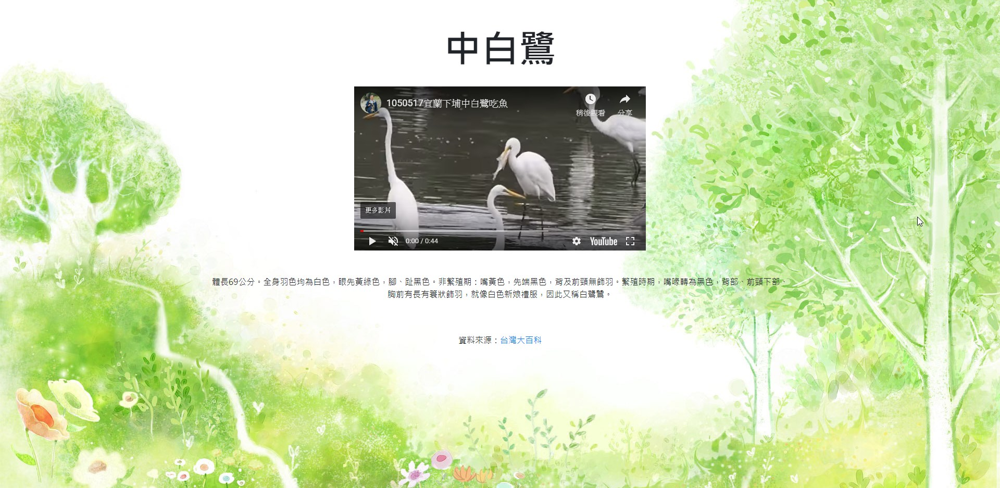
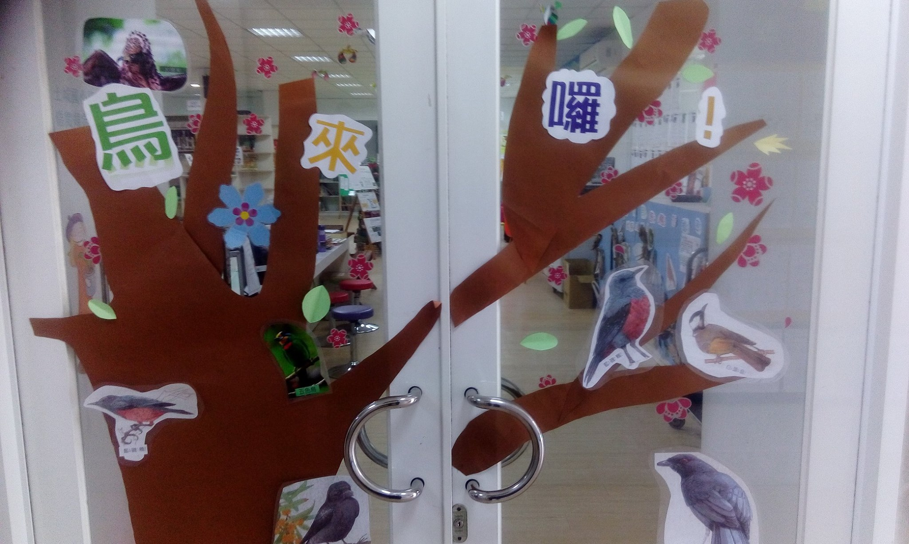
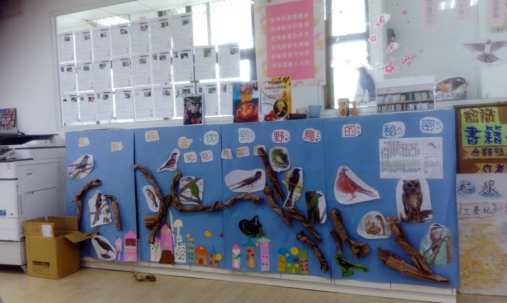
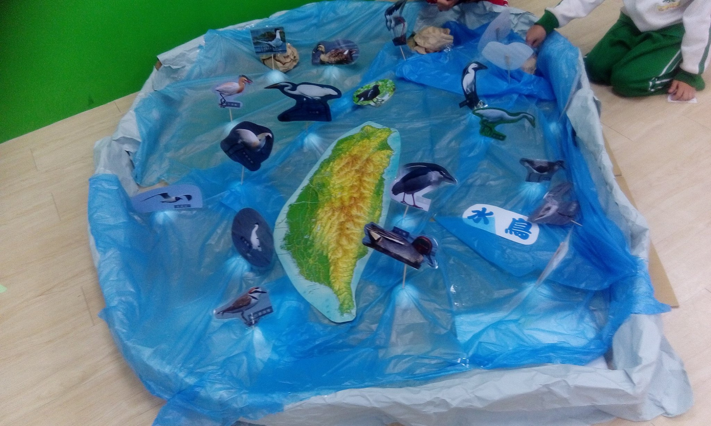
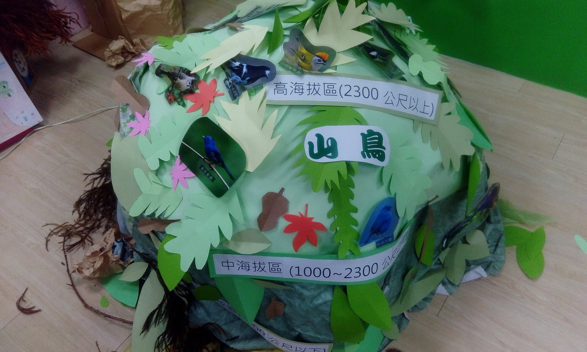
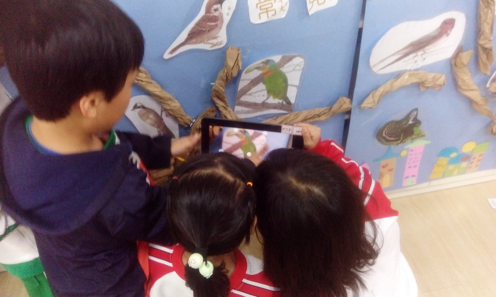
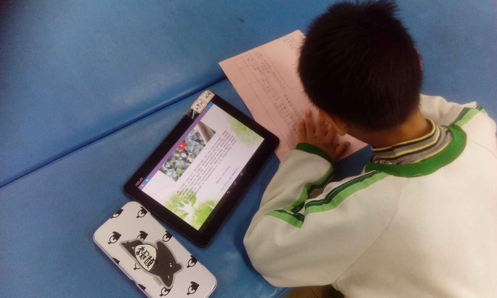

# 鳥類小百科
2017 年新北市土城國小圖書館鳥來了活動 AR 數位教材  

## 使用方式
- 將 `bird.sql` 匯入資料庫
- 在 `config.php` 填寫資料庫連線設定
- 在 Aurosma 建立 AR 鳥類圖片，設定掃描後點擊導向至該鳥類的介紹

## 活動照片

## 活動影片
- [YouTube](https://www.youtube.com/watch?v=_V6kBJohrMc)  